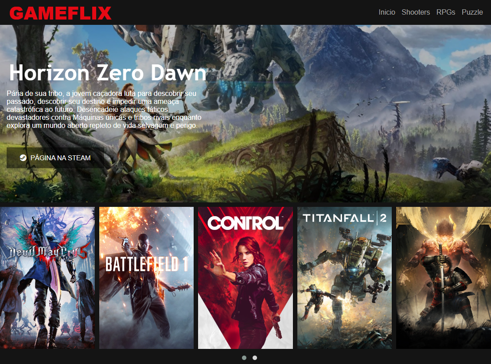
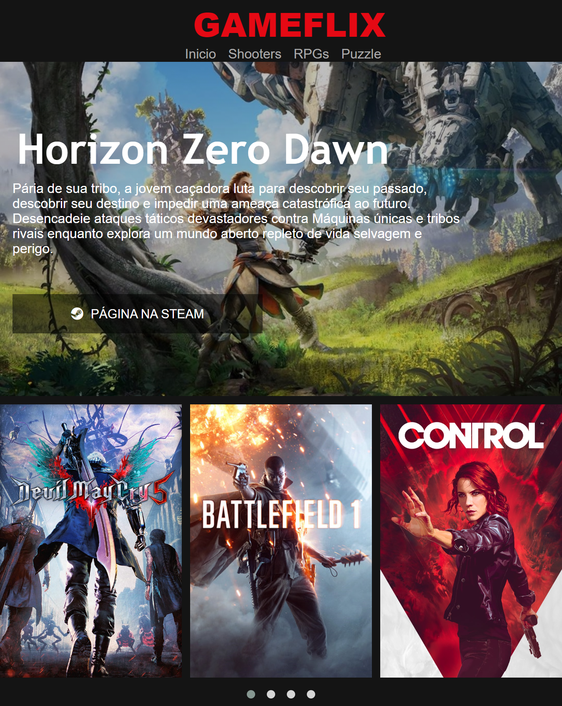

## Breve mostragem de um mini-projeto feito como desafio do Bootcamp da DIO.

O desafio do Bootcamp era fazer uma página CLONE da Netflix, porém eu resolvi mudar o tema de filmes para jogos. O mini-projeto foi feito de forma que ficasse responsivo e pela primeira vez eu usei JQuery (apesar de todos falarem que ele está morrendo).

### Imagens do Projeto:

#### Como fica em uma resolução de monitor de PC:

_____________________

#### Como fica ao mudar a resolução (responsividade):

